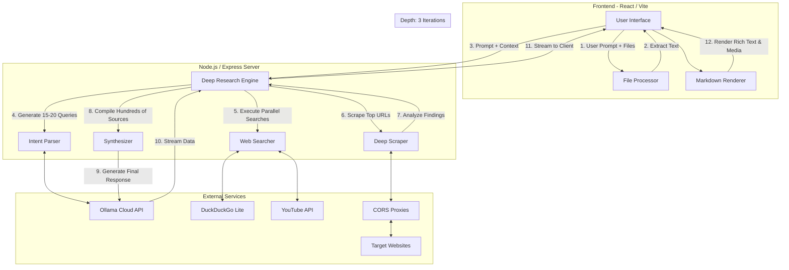

# Lorph

https://github.com/user-attachments/assets/6e7b9ead-527c-40e4-acaf-0a8243ea25d2


Lorph is a full-stack AI chat application built to interact with cloud-based Large Language Models (LLMs) using the Ollama framework. It combines a React frontend for handling user inputs and file processing with a Node.js backend dedicated to deep web research, scraping, and response synthesis.

## Key Features

*   **Multi-Model Chat**: Connects to various cloud LLMs through Ollama.
*   **Deep Web Research**: The backend parses user intent, generates search queries, runs parallel web searches, and scrapes web pages to provide accurate, cited answers.
*   **Local File Processing**: Extracts text directly in the browser from Images (OCR), PDFs, Word documents (.docx), Excel files (.xlsx), and plain text/code files.
*   **Rich Media & Citations**: Automatically embeds inline citations, extracted images, and YouTube videos found during the research phase.
*   **Responsive UI**: A dark-themed, chat-based interface that handles dynamic model selection, file attachments, and real-time streaming text.

## System Architecture & Data Flow

This diagram shows how data moves from the user's input to the final response, highlighting the multi-iteration deep research loop.



## Installation and Setup

Follow these steps to run Lorph locally.

### Step 1: Clone the Repository

```bash
git clone https://github.com/AL-MARID/Lorph.git
cd Lorph
```

### Step 2: Configure Ollama and API Key

Lorph requires the Ollama client to connect to cloud models and an API key for authentication.

#### Prerequisites

1.  **Ollama Account**: Create an account at [Ollama](https://ollama.com).
2.  **Email Verification**: Verify your registered email address.
3.  **Login Credentials**: Have your Ollama login credentials readily available.

#### Manual Ollama Installation

Install the Ollama client on your local machine.

*   **Linux & macOS**: `curl -fsSL https://ollama.com/install.sh | sh`
*   **Windows**: Download from [ollama.com/download/windows](https://ollama.com/download/windows)

#### Ollama Server and Login

1.  **Start Ollama Server**: In a new terminal, initiate the server process:
    ```bash
    ollama serve
    ```
2.  **Device Pairing & Login**: In a separate terminal, authenticate your device:
    ```bash
    ollama signin
    ```
    Follow the on-screen instructions to open the authentication URL and connect your device.

#### API Key Configuration

To enable Lorph to connect with Ollama's cloud models, an API key must be configured.

1.  **Generate API Key**: After completing the device pairing, generate a new API key from your Ollama settings: [ollama.com/settings/keys](https://ollama.com/settings/keys).
2.  **Create `.env.local` file**: In the root of the Lorph project directory, create a new file named `.env.local`.
3.  **Add API Key**: Insert the generated key into the `.env.local` file.
    ```env
    OLLAMA_CLOUD_API_KEY=your_api_key_here
    ```

### Step 3: Install Dependencies

Use your preferred package manager to install the required packages.

```bash
npm install
```

### Step 4: Build and Run the Application

1.  **Development Mode**:
    ```bash
    npm run dev
    ```
    This starts the Express server and Vite middleware concurrently.

2.  **Production Build**:
    ```bash
    npm run build
    npm start
    ```

Access the application at `http://localhost:3000` in your browser.

## Technical Details

### Supported Cloud Models

Lorph is configured to interact with the following cloud-based LLMs through Ollama:

*   `deepseek-v3.1:671b-cloud`
*   `gpt-oss:20b-cloud`
*   `gpt-oss:120b-cloud`
*   `kimi-k2:1t-cloud`
*   `qwen3-coder:480b-cloud`
*   `glm-4.6:cloud`
*   `glm-4.7:cloud`
*   `minimax-m2:cloud`
*   `mistral-large-3:675b-cloud`

### Technology Stack

*   **Frontend**: React 19, Vite, Tailwind CSS, Lucide React
*   **Backend**: Node.js, Express
*   **Language**: TypeScript
*   **Markdown Rendering**: React Markdown, remark-gfm, React Syntax Highlighter
*   **File Processing**: PDF.js, Tesseract.js, Mammoth, read-excel-file
*   **Web Scraping & Search**: Cheerio, node-fetch, yt-search

### File Processing Capabilities

Lorph extracts text from attached files locally in the browser before sending the context to the backend.

*   **Images (JPEG, PNG)**: OCR text extraction via Tesseract.js.
*   **PDF**: Multi-page text extraction via PDF.js.
*   **Word (DOCX)**: Raw text extraction via Mammoth.
*   **Excel (XLSX)**: Row-column parsing via read-excel-file.
*   **Plaintext / Code**: Direct file read (TXT, MD, JSON, CSV, JS, TS, PY, etc.).

### Web Search Integration (Deep Research)

The backend handles web search through an intensive, multi-layered iterative process designed to gather hundreds of sources:

1.  **Initial Intent Parsing**: The LLM analyzes the user's core intent and generates an initial batch of 15-20 highly specific search queries.
2.  **Iterative Research Loop (Depth of 3)**: The engine performs 3 complete cycles of research. In each cycle, it:
    *   Executes parallel searches across DuckDuckGo Lite and YouTube for all current queries.
    *   Discovers and deduplicates hundreds of URLs.
    *   Deeply scrapes the top URLs using proxy rotation to bypass restrictions, extracting core text, OpenGraph images, and embedded videos via Cheerio.
    *   Analyzes the newly gathered context to generate another 15-20 highly targeted queries for the next iteration to fill knowledge gaps.
3.  **Massive Scale Compilation**: By the end of the 3 iterations, the engine compiles and processes a massive dataset (often 500-700+ sources).
4.  **Synthesis & Citation**: The most relevant extracted context is sent to the LLM to synthesize a comprehensive, expert-level final response, complete with strict inline citations and embedded rich media.

## Contributing

1.  Fork the repository.
2.  Create a new branch (`git checkout -b feature/YourFeature`).
3.  Commit your changes (`git commit -m 'Add some feature'`).
4.  Push to the branch (`git push origin feature/YourFeature`).
5.  Open a Pull Request.

## License

This project is distributed under the MIT License. See the [LICENSE](LICENSE) file for details.
